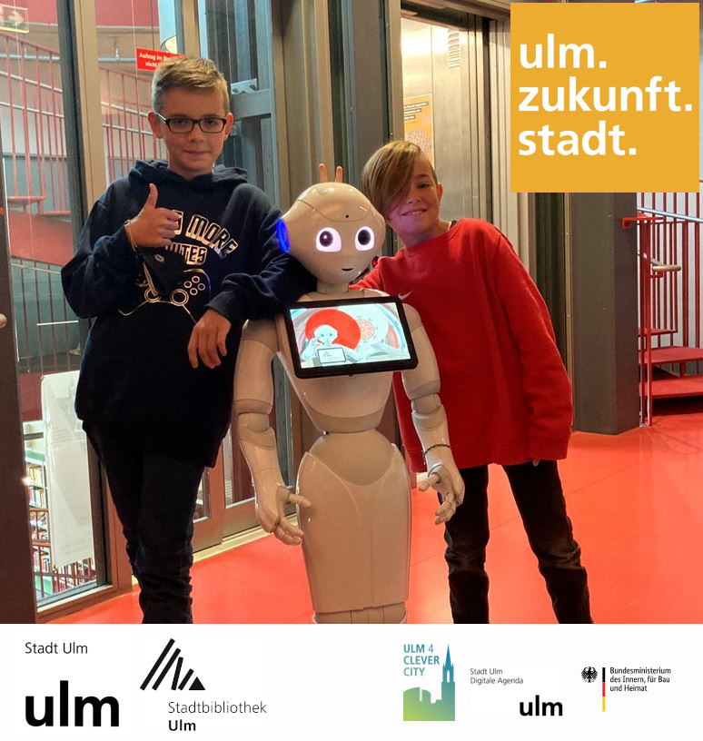
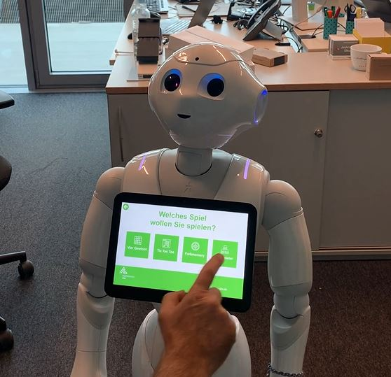

 

  

 

 
  <h2 align="center">Softbank pepper supports our visitors   [Part: Games]</h2>
  
  <!-- ABOUT THE PROJECT -->
  <h3>Introduction</h3>
  
  The aim of the Public Library Ulm is to use robotics to assist citizens and employees in our library.
  For this purpose our humanoid robot shut be able to move autonomously in our central library, among users and visitors. 
  The robot should be able to solve standard tasks autonomously.
  In the medium term, our robot should support the use of library services such as library information, media reseaches and child-friendly offers. 
  In the future, the robot will also provide general urban information and citizen services, such as timetable information, bus stops, etc. to our visitors.
  
  
(<a href="#top">back to top</a>)

  
  <h3>Promotion</h3>
  The project of user support by a humanoid robot was created in cooperation between the Ulm City Library and the Digital Agenda office of the City of Ulm and was  realized with funds from the "Smart Cities made in DE" funding of the Ministry of the Interior, Building and Community (BMI).
  
  
(<a href="#top">back to top</a>)

  <h3>Built With / necessary Hardware</h3>
  <ul>
    <li>Softbank Choregraphe suite (https://developer.softbankrobotics.com/)</li>
    <li>python (https://www.python.org/)</li> 
    <li>Softbank Pepper (python-version) </li>
  </ul> 

  
(<a href="#top">back to top</a>)

  <h3>About the Project</h3>
  <b> project goal</b>  
  "Realization of an indoor navigation based on the Softbank Pepper (python-version) ". Limited by the hardware used in the pepper
  The robot tries to get the visitor's attention and supports them in using the library account and the "library of things"
  The user is guided through the information by means of dialogs.
  <b>Different games with and against the robot were realized as an entertaining element.</b>
  

    
   
(<a href="#top">back to top</a>)
 
    
   <h3>How was this project developed ?</h3>
   Developed on version 2.5 of NAOqi, Pepper's operating system, this application was developed using the Choregraphe software. 
  
  
(<a href="#top">back to top</a>)

    
   <h3>Result [Games]</h3>
    
  

    
  

 
   
(<a href="#top">back to top</a>)

   

